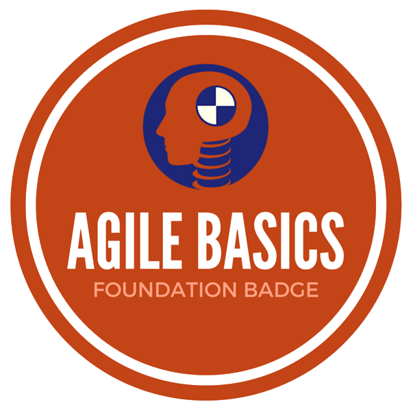
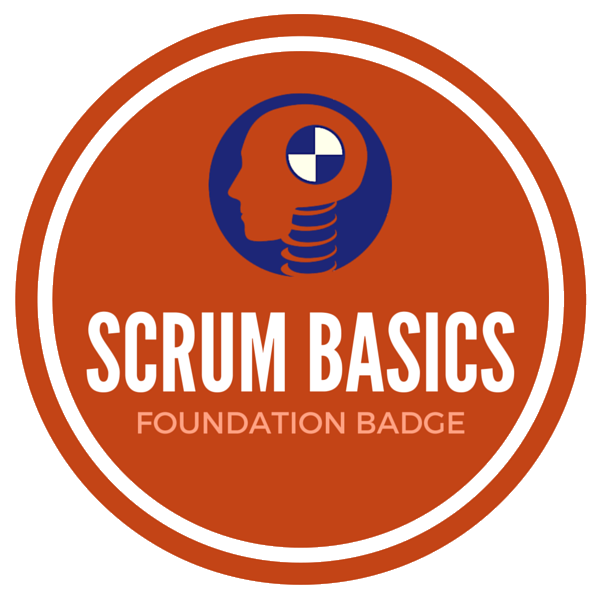
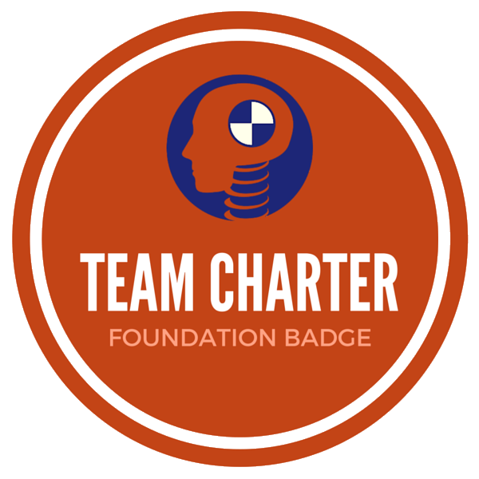
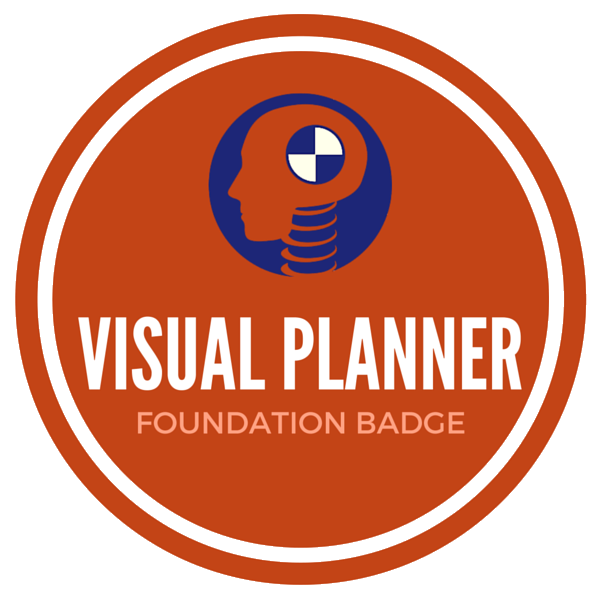
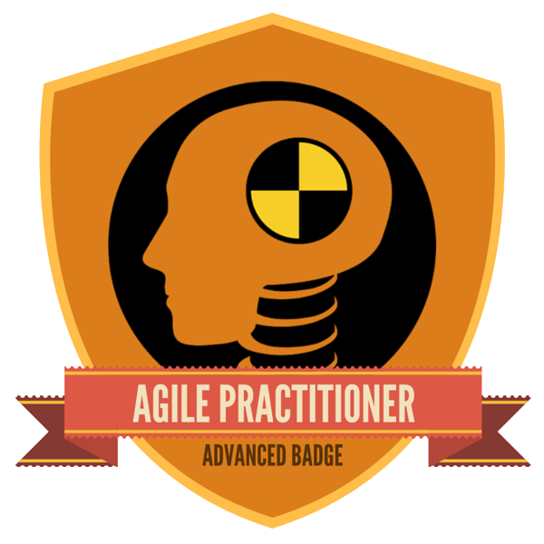

# Project Management

This module will introduce some commonly used processes for project management in an agile project environment. The concepts learned in this module will be applied to the management of your personal project throughout the course.

## Learning Outcomes

Upon completion of this module you should be able to:

- a. Describe the key ways Agile differs from other project management styles
- b. Identify and explain the four key values of Agile
- c. Identify and explain the purpose of each step of the Scrum process
- d. Organise and document an Agile Scrum project in the form of a Team Charter
- e. Manage project workflow using a Scrum task board with user stories and sub-tasks
- f. Confidently participate in all aspects of the Scrum process in a team setting
{:.learning-outcomes}

## Classroom | Being Agile

- [Lecture: Introduction][intro]
- [Activity: Coin Flip Game][coin-game]
- [Lecture: Agile Manifesto][manifesto]
- [Activity: Agile Mindset Workshop][agile-poster]
- [Lecture: Team Charter][team-charter]
- [Activity: Write a Team Charter for the course][charter-activity]

[intro]: {{ site.slideshows }}/modules/project-management/introduction
[coin-game]: activities/coin-game.html
[battleships]: http://tastycupcakes.org/2012/02/you-sunk-my-methodology/
[manifesto]: {{ site.slideshows }}/modules/project-management/agile-manifesto
[agile-poster]: activities/agile-poster.html
[team-charter]: {{ site.slideshows }}/modules/project-management/team-charter
[charter-activity]: activities/team-charter.html

 
**Additional Resources**

- [Agile Manifesto (website)](http://agilemanifesto.org/)
- [Comparing Project Management Methodologies (article)](https://www.wrike.com/project-management-guide/methodologies/)
- [Agile Samurai (book)](http://librarysearch.auckland.ac.nz/UOA2_A:Combined_Local:uoa_alma21257524290002091)
- [The Mythical Man Month (essay)](https://www.cs.drexel.edu/~yfcai/CS451/RequiredReadings/MythicalManMonth.pdf)
- [Making Sense of Minimum Viable Product (blog)](http://blog.crisp.se/2016/01/25/henrikkniberg/making-sense-of-mvp)

## Independent | Team Charter

- [Activity: Write a Team Charter for your own project](independent-charter)

[independent-charter]: activities/independent-charter.html

- [Project Mangement Quiz] 

## Classroom | Agile Tools and Processes

- [Lecture: Introduction to Scrum][scrum]
- [Lecture: Scrum Roles][scrum-roles]
- [Activity: Understanding Roles][roles-activity]
- [Lecture: User Stories][user-stories]
- [Activity: Story Estimates][story-sizing]
- [Lecture: Sprints][sprints]
- [Activity: Scrum Card Game][scrum-cards]

[scrum]: {{ site.slideshows }}/modules/project-management/scrum
[scrum-roles]: {{ site.slideshows }}/modules/project-management/scrum-roles
[roles-activity]: http://tastycupcakes.org/2013/02/the-herculean-doughnut/
[user-stories]: {{ site.slideshows }}/modules/project-management/user-stories
[story-sizing]: http://tastycupcakes.org/2009/09/sizing-game/
[sprints]: {{ site.slideshows }}/modules/project-management/sprints
[scrum-cards]: http://tastycupcakes.org/2016/06/scrum-card-game/

 
**Additional Resources**

- [Introduction to Scrum - 7 Minutes (video)](https://www.youtube.com/watch?v=9TycLR0TqFA)
- [Everything About User Stories (article)](https://www.mountaingoatsoftware.com/agile/user-stories)
- [Agile Chalk Talk: Story Points (video)](https://www.youtube.com/watch?v=90Xx8QVnXRc)
- [How to run a sprint planning meeting (blog)](http://nomad8.com/how-to-run-a-sprint-planning-meeting-the-way-i-like-it/)
- [Scrum in a 2-person Team (blog)](http://www.boost.co.nz/blog/2013/01/the-tiny-scrum/)
- [It's Not Just Standing Up](http://martinfowler.com/articles/itsNotJustStandingUp.html)

## Independent | Workflow Management

- [Create Project Backlog](project-backlog)
- [Lecture: Project tracking with Kanban (TODO)](#)
- [Activity: Set up a Kanban Board (TODO)](#)

<!--
## Independent | Elevator Pitches

- [Lecture: Pitching][pitching]
- [Activity: The Customer Pitch (TODO)](#)
- [Activity: The Casual Pitch (TODO)](#)
- [Activity: Project Vision (TODO)](#)
- [Activity: Peer Review (TODO)](#)

[pitching]: {{ site.slideshows }}/modules/project-management/pitches
-->

## Additional Resources

- [Pomodoro Technique](http://pomodorotechnique.com/)

{:.resources}

## Badges

1. ### Agile Basics

Identify and explain the four key values of Agile in a short interview with a tutor.
_Learning outcomes: b_

2. ### Scrum Basics

Identify and explain the purpose of each step of the Scrum process in a short interview with a tutor.
_Learning outcomes: c_

3. ### Team Charter

Organise and document an Agile Scrum project in the form of a Team Charter. Publish it with your project and have it reviewed by a tutor.
_Learning outcomes: d_

4. ### Visual Planner

Use a Scrum board to manage your project for at least 3 weeks. Take a photo or screenshot of your board each week. Write 200 words reflecting on the benefits and difficulties (if any) of this style of visual planning.
_Learning outcomes: e_

5. ### Standup Facilitator

Act as Scrum Master for a daily standup meeting, ensuring everyone shares their status and progress according to the rules of daily standup. Gain a sentence or two of written feedback on your facilitation from 3 classmates. Act as Scrum Master at daily standup a second time then reflect on the experience (200 words).

6. ### Agile Practitioner

Review your adherence to the Agile Manifesto and reflect on which aspects you are struggling with and could improve, and/or which you find most beneficial. Do this three times, at least a week apart. (150 words each).
{:.badges}
